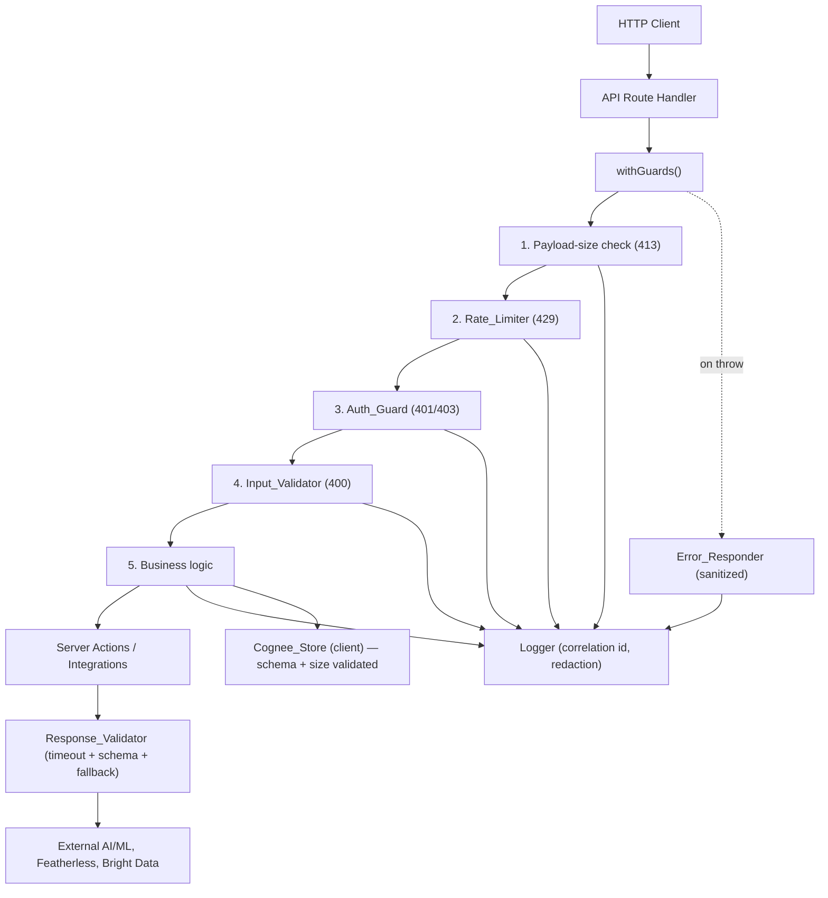

# Design Document

## Overview

This design hardens the PreIntent MVP (Next.js App Router, TypeScript, mock-first) for security and quality without changing its demo behavior or its zero-cost, mock-first default. It introduces a small set of shared, server-side primitives that every API route and server action composes:

- **Input_Validator** — zod-based parsing of request bodies, query/path params, and URL/size limits.
- **Auth_Guard** — Supabase-session authentication plus `organization_members` authorization for mutating endpoints.
- **Rate_Limiter** — per-caller fixed-budget limiting on costly endpoints with fail-closed behavior.
- **Response_Validator** — schema validation, timeouts, and fallbacks for external/model responses.
- **Error_Responder + Logger** — sanitized client errors paired with structured, correlation-ID'd server logs and secret/PII redaction.
- **Cognee_Store hardening** — schema + size validation on `localStorage` reads/writes with discard-and-recover semantics.
- **Type-safety fixes** — repair the broken `onboarding/profile` route (missing modules, `runLiveSweep` signature mismatch, `any` usage) so `tsc` and `eslint` pass clean.

The guiding principles are:

1. **Mock-first stays default.** No new required secrets, no behavior change when modes are `mock`. Every new guard degrades safely.
2. **Server-side only.** All secret reads, validation of external responses, auth, and logging happen in server execution contexts. Nothing new is shipped to the browser bundle.
3. **Compose, don't rewrite.** Routes keep their handlers; they wrap them with shared helpers. Existing good patterns (zod in `sweep`/`score`, auth in `competitors/resolve` orgId path) are generalized, not replaced.
4. **Fail safe.** Validation failure, auth failure, rate-limit exhaustion, and backend unavailability all reject *before* any external call or persistence and leave state unchanged.

### Research Notes

- **Next.js App Router route handlers** receive a Web `Request`. There is no built-in body-size guard, so payload-size enforcement must read `Content-Length` (and cap the read) before `request.json()`. This informs Requirement 1.4.
- **Supabase auth**: the project already uses `@supabase/ssr` `createServerClient` via `createSupabaseServerClient()` and the `auth.getUser()` + `organization_members` membership query (see `src/app/api/competitors/resolve/route.ts`). The Auth_Guard generalizes exactly this proven pattern rather than introducing new middleware.
- **zod v4** (`zod@^4.4.3`) is already a dependency and is the validation tool of record. `z.safeParse` returns a discriminated `{ success, data | error }` and `error.issues` provides per-field path + code, which maps directly to the sanitized field-level error format in Requirement 4.5.
- **Property-based testing**: no PBT library is present yet. `fast-check` is the standard choice for the TS/vitest ecosystem and integrates as `fc.assert(fc.property(...))`. It will be added as a dev dependency. Round-trip and invariant properties (Cognee, Response_Validator, Convergence) are classic fast-check use cases.
- **Rate limiting**: the MVP runs as a single Next.js process with no Redis. An in-process store (Map keyed by caller + endpoint, rolling/fixed window of timestamps) satisfies the per-caller 10-req/60s requirement at zero cost, with a documented seam for a shared backend later. The "tracking backend unavailable → 429 fail-closed" rule (6.7) is modeled as a store operation that can throw.

## Architecture

The hardening primitives live in a new `src/lib/security/` module and are composed by route handlers. A single `withGuards` wrapper sequences the cross-cutting concerns in the correct order.



**Ordering rationale.** Cheap, abuse-resistant checks run first. Payload-size rejection (413) happens before the body is parsed so a huge body is never buffered. Rate limiting (429) runs before auth and validation so unauthenticated floods are cheaply shed. Auth (401/403) runs before input validation so unauthenticated callers learn nothing about the schema. Input validation (400) is the last gate before business logic. Every stage emits logs under one correlation id; any thrown error is caught by the wrapper and converted by the Error_Responder.

Note: Requirement 2 (auth before external calls) and Requirement 6 (rate-limit before external calls) are both satisfied because all four gates precede the handler. The relative order of the 429 vs 401 gates is an implementation choice; both occur before any side effect, so neither can leak state.

### Module layout

```text
src/lib/security/
  schemas.ts          # shared zod schemas (URL, payload limits, route bodies, params)
  input-validator.ts  # parseBody / parseParams / payload-size guard
  auth-guard.ts       # requireSession / requireOrgMembership (wraps createSupabaseServerClient)
  rate-limiter.ts     # in-process fixed-window limiter, fail-closed
  error-responder.ts  # toErrorResponse(error, correlationId) -> NextResponse
  logger.ts           # structured logger, correlation id, secret/PII redaction
  response-validator.ts # validateExternal(schema, value) + fetchWithTimeout + fallback
  with-guards.ts      # composition wrapper sequencing the above
  correlation.ts      # correlation id generation/propagation
src/lib/cognee.ts      # hardened: schema + size validation, discard-and-recover, logging
src/app/api/**/route.ts # refactored to compose withGuards
src/app/api/onboarding/profile/route.ts # rewritten: real imports, correct runLiveSweep call, typed
```

## Components and Interfaces

### Input_Validator

Wraps zod parsing and the payload-size guard. Pure with respect to its inputs (no I/O), so it is highly testable.

```ts
interface ValidationFieldError { field: string; reason: "missing" | "malformed" | "out_of_range" }
type ValidationResult<T> =
  | { ok: true; value: T }
  | { ok: false; errors: ValidationFieldError[] };

// Reads Content-Length; rejects > maxBytes (default 1_048_576) WITHOUT parsing.
function enforcePayloadSize(req: Request, maxBytes?: number): { ok: true } | { ok: false; status: 413 };

function parseBody<T>(schema: ZodType<T>, raw: unknown): ValidationResult<T>;
function parseParams<T>(schema: ZodType<T>, params: Record<string, unknown>): ValidationResult<T>;
```

- Maps `ZodError.issues` to `ValidationFieldError[]`: `invalid_type`/`too_small` on undefined → `missing`; type/format mismatches → `malformed`; range/length violations → `out_of_range`.
- A shared `httpUrl` schema enforces syntactically valid `http`/`https` and `length <= 2048` (Req 1.5, 1.9).
- The validator never invokes business logic; on failure the route returns 400 (or 413 for size) and performs no external call or persistence (Req 1.2, 1.4, 1.8).

### Auth_Guard

Generalizes the existing `competitors/resolve` orgId pattern.

```ts
interface AuthedCaller { userId: string; }
type AuthResult =
  | { ok: true; caller: AuthedCaller }
  | { ok: false; status: 401 | 403 | 400 };

async function requireSession(): Promise<AuthResult>;            // 401 if no/expired/invalid session
async function requireOrgMembership(orgId: string): Promise<AuthResult>; // 400 bad orgId, 401 no session, 403 not a member
```

- Uses `createSupabaseServerClient()` + `auth.getUser()`; membership via `organization_members` (`organization_id`, `user_id`).
- `requireOrgMembership` validates `orgId` shape (non-empty UUID) first → 400 when missing/malformed (Req 2.6), 401 when unauthenticated, 403 when authenticated-but-not-a-member (Req 2.3, 2.4, 2.5).
- All checks resolve before any service-role client construction or external call (Req 2.1, 2.5).
- Public_Endpoints (`health`, `auth/callback`, `auth/signout`, read-only `integrations`/`score` GET) do not call the guard (Req 2.8).

### Rate_Limiter

In-process fixed-window limiter; documented seam for a shared backend.

```ts
interface RateDecision { allowed: boolean; retryAfterSeconds?: number; status?: 429 }
function checkRateLimit(callerKey: string, endpointId: string,
  opts?: { max?: number; windowSeconds?: number }): RateDecision; // defaults max=10, window=60
```

- Caller key: authenticated `userId` when present, else source IP (`x-forwarded-for` first hop / request IP) (Req 6.3).
- Independent budget per `endpointId` for `sweep`, `competitors/resolve`, `onboarding/profile` (Req 6.5).
- On the 11th request within the window → 429 with `Retry-After` = whole seconds until the window frees a slot, clamped to 1..60 (Req 6.1, 6.4).
- The store read/increment is wrapped so that if it throws (backend unavailable) the decision is `{ allowed: false, retryAfterSeconds: 60, status: 429 }` (fail-closed, Req 6.7).
- Runs before the handler so no external call or persistence occurs on a rejected request (Req 6.6).

### Response_Validator

Validates external/model responses and centralizes timeout + fallback.

```ts
async function fetchWithTimeout(input, init, timeoutMs?: number): Promise<Response>; // default 10_000, ceiling 30_000
function validateExternal<T>(schema: ZodType<T>, parsed: unknown, source: string,
  correlationId: string): { ok: true; value: T } | { ok: false };
async function withFallback<T>(primary: () => Promise<T>, fallback: () => T | Promise<T>,
  ctx: { source: string; correlationId: string }): Promise<T>;
```

- `validateExternal` blocks downstream use until validation succeeds; on failure it logs the failing component + reason and signals the caller to use the fallback (Req 5.1, 5.2, 5.3, 5.4).
- Parse failures (`JSON.parse` throw) and timeouts are treated identically: log + fallback, downstream state unchanged (Req 5.5, 5.6).
- `fetchWithTimeout` enforces a configurable timeout capped at 30s (default 10s) via `AbortSignal.timeout`. The existing 90s/60s timeouts in `actions.ts` are reduced under this ceiling.
- For a value already conforming to the schema, `validateExternal` returns a value deep-equal to the input (round-trip identity, Req 5.7) — achieved by using schemas that do not coerce/transform (no `.default()`/`.transform()` on the validation path; defaults belong to fallback construction, not validation).

### Error_Responder + Logger

```ts
function toErrorResponse(error: unknown, correlationId: string): NextResponse; // sanitized body + status
function validationErrorResponse(errors: ValidationFieldError[], correlationId: string): NextResponse; // 400

type Severity = "debug" | "info" | "warn" | "error";
interface LogRecord { severity: Severity; source: string; correlationId: string; timestamp: string; message: string; meta?: Record<string, unknown> }
const logger = {
  log(severity: Severity, source: string, correlationId: string, message: string, meta?): void;
  audit(entry: { caller: string; endpointId: string; correlationId: string; outcome: "success" | "failure" }): void;
};
```

- `toErrorResponse` returns a generic message + category status within 1000ms of catch; excludes stack traces, raw external messages, file paths, hostnames, IPs, DB/table identifiers; echoes the same correlation id the Logger recorded (Req 4.1, 4.2, 4.4). It returns the sanitized response even if logging throws (Req 4.6, 8 best-effort logging).
- `validationErrorResponse` lists every failed field + reason category, with no internal schema names/types (Req 4.5).
- Logger emits structured records with severity (ordered set), source, correlation id, timestamp (Req 8.3); one correlation id per request shared across all records (Req 4.3, 8.4); redacts secret values and end-user PII with a fixed placeholder (Req 3.6, 8.6); suppresses records below configured level (Req 8.7).
- Mutating endpoints emit one audit event (caller ref, endpoint id, correlation id, outcome) on completion (Req 8.5).

### Secret handling

No secret value ever crosses to the client. The Integration health layer already reports presence, not values; this is tightened to a strict boolean and audited.

- All `process.env.*_KEY`/`*_SERVICE_ROLE_KEY` reads stay in server modules (routes, `actions.ts`, `src/lib/integrations/*`) (Req 3.1).
- Integration status exposes `configured: boolean` only — never the value or any substring (Req 3.3). `not_configured` is reported when a real-mode adapter lacks its key, and the adapter falls back to mock (Req 3.4, 3.5).
- Logger redaction guarantees secrets appear by key name only (Req 3.6).

### Cognee_Store hardening

`src/lib/cognee.ts` gains schema + size validation and discard-and-recover. The public function names stay the same so callers are unaffected.

```ts
const profileRecordSchema: ZodType<AccountIntelligenceProfile>; // mirrors domain.ts
const profileMapSchema = z.record(z.string(), profileRecordSchema); // + max 10_000 keys

function loadAll(): Record<string, AccountIntelligenceProfile>; // parse -> schema -> size; discard+log on any failure
function saveProfile(profile: AccountIntelligenceProfile): void; // validate record; skip persist if non-conformant; catch quota errors
```

- Read path: JSON parse failure (Req 7.2), schema failure (Req 7.3), or > 10,000 records (Req 7.1, 7.4) → discard and initialize empty set, no unhandled error; log discard with reason (Req 7.5).
- Write path: serialize only schema-conformant records, reject non-conformant without persisting (Req 7.6); on `localStorage` write failure (quota) leave prior value intact and log write-failure (Req 7.7).
- Round-trip: writing then reading a valid record yields an equivalent record (Req 7.8). `saveProfile` currently overwrites `lastUpdated`; the round-trip property is defined over the schema-defined fields with `lastUpdated` treated as a write-stamped field (the read-back value equals the written value as stored).

### Type-safety fixes (onboarding/profile + `any` removal)

The current `onboarding/profile/route.ts` does not compile against the real codebase. It will be rewritten to:

- Remove imports of the non-existent `@/actions/sweep-actions`, `@/actions/org-actions`, `@/actions/competitor-actions`.
- Call the real `runLiveSweep(input: LiveSweepInput)` from `@/app/actions` with the correct shape (`account`, `industry`, `employees`, `competitor`, …) and consume `LiveSweepResult` (`.success`, `.profile`, `.signals`, `.brief`), not the non-existent `.data` shape (Req 9.3, 9.5).
- Replace `body: any`, `signal: any`, `err: any`, `error: any` with explicit named types parsed through the Input_Validator (Req 9.4).
- Apply Auth_Guard (org membership for `orgId`), Input_Validator (`orgId` + `seedAccounts`), and Rate_Limiter before any service-role client construction.
- Persist via Supabase only with validated row shapes.

The acceptance bar is `npm run typecheck` and `npm run lint` exiting 0 with zero errors/warnings (Req 9.1, 9.2, 9.6).

## Data Models

### Shared validation schemas (`src/lib/security/schemas.ts`)

```ts
const httpUrlSchema = z.string().url().max(2048)
  .refine(u => /^https?:\/\//i.test(u), "must be http(s)");

const MAX_PAYLOAD_BYTES = 1_048_576;

const commandCenterBodySchema = z.object({
  command: z.string().min(1).max(200),
  payload: z.record(z.string(), z.unknown()).optional(),
});

const seedAccountSchema = z.object({
  name: z.string().trim().min(1).max(200),
  website: httpUrlSchema.optional(),
});
const onboardingProfileBodySchema = z.object({
  orgId: z.string().uuid(),
  seedAccounts: z.array(seedAccountSchema).min(1).max(100),
});

const orgIdParamSchema = z.string().uuid();
```

`sweepBodySchema` (already in `sweep/route.ts`) and `scoreRequestSchema` (already in `score/route.ts`) are moved into `schemas.ts` and reused. URL fields in `sweepBodySchema` adopt `httpUrlSchema`.

### Response validation schemas

```ts
// Pain classifier (currently JSON.parsed unchecked in actions.ts)
const painClassificationSchema = z.object({
  signalType: z.string(),
  urgency: z.enum(["low", "medium", "high", "unknown"]),
  competitorMentioned: z.string().nullable(),
  inferredSeniority: z.string(),
  companyAttribution: z.string(),
  confidence: z.number().min(0).max(1),
});

// Intel brief payload already validated by intelBriefPayloadSchema in actions.ts (kept, defaults moved to fallback path).
```

### Cognee persistence schema

```ts
const engineSignalSchema = z.object({
  id: z.string(), engine: z.enum(["void", "compliance", "pain"]),
  title: z.string(), description: z.string(), eventTime: z.string(),
  subScore: z.number(), confidence: z.number(),
  provenance: z.object({ sponsor: z.string(), tool: z.string().optional(),
    url: z.string().optional(), capturedAt: z.string(), note: z.string().optional() }),
  rawEvidence: z.record(z.string(), z.unknown()).optional(),
});
const profileRecordSchema = z.object({
  account: z.string(), industry: z.string(), employees: z.union([z.number(), z.string()]),
  crmStage: z.string(), lastUpdated: z.string(),
  void: z.object({ signals: z.array(engineSignalSchema), subScore: z.number() }),
  compliance: z.object({ signals: z.array(engineSignalSchema), subScore: z.number() }),
  pain: z.object({ signals: z.array(engineSignalSchema), subScore: z.number() }),
  convergenceScore: z.number(), urgency: z.enum(["LOW", "MEDIUM", "HIGH", "CRITICAL"]),
  thresholdCrossedAt: z.string().optional(),
});
const MAX_PROFILE_RECORDS = 10_000;
```

### Log record / audit model

```ts
type Severity = "debug" | "info" | "warn" | "error"; // ordered ascending
interface LogRecord { severity: Severity; source: string; correlationId: string; timestamp: string; message: string; meta?: Record<string, unknown> }
interface AuditRecord { caller: string; endpointId: string; correlationId: string; outcome: "success" | "failure"; timestamp: string }
```

## Correctness Properties

*A property is a characteristic or behavior that should hold true across all valid executions of a system — essentially, a formal statement about what the system should do. Properties serve as the bridge between human-readable specifications and machine-verifiable correctness guarantees.*

The properties below were derived from the prework analysis. Acceptance criteria that depend on external services (Supabase auth, the AI/ML endpoint), one-time tooling outcomes (`typecheck`/`lint`/`build`), or static/scan guarantees (secret-in-bundle) are intentionally excluded from property-based testing and are covered by example, integration, or smoke tests in the Testing Strategy.

### Property 1: URL field accept-iff-valid

*For any* string, the `httpUrlSchema` accepts it if and only if it is a syntactically valid `http` or `https` URL whose length does not exceed 2,048 characters; every other string is rejected.

**Validates: Requirements 1.5, 1.9**

### Property 2: Invalid input is rejected with no side effects

*For any* request body or parameter set that does not conform to its schema, the Input_Validator returns a failure result, the route responds with HTTP 400, and no external service call or persistence operation is invoked, leaving system state unchanged.

**Validates: Requirements 1.1, 1.2, 1.3, 1.8, 2.6**

### Property 3: Integration status never leaks secret values

*For any* environment map containing arbitrary secret values, the integration status output represents each secret's presence as a boolean that is true exactly when the secret is configured, and contains no secret value or any substring of a secret value; a real-mode adapter missing its key is reported as `not_configured`.

**Validates: Requirements 3.3, 3.4**

### Property 4: Secret and PII values are redacted in logs

*For any* log record whose fields contain known secret values or end-user personally identifiable values, the emitted record replaces each such value with the fixed redaction placeholder and contains neither the literal value nor any partial portion of it.

**Validates: Requirements 3.6, 8.6**

### Property 5: Client error responses are sanitized

*For any* caught error — including ones whose message embeds stack traces, raw external messages, internal file paths, hostnames, IP addresses, database/table identifiers, or secret values — the Error_Responder's client-facing body contains none of those tokens and carries an HTTP status in the correct category.

**Validates: Requirements 4.1, 4.2, 8.2**

### Property 6: Correlation id is echoed to the caller

*For any* request-handling scope, the correlation identifier included in the sanitized client error response equals the correlation identifier recorded by the Logger for that same scope.

**Validates: Requirements 4.4**

### Property 7: Validation error rendering is complete and internal-detail-free

*For any* non-empty set of field validation errors, the rendered client-facing message names every failed field together with a reason category (missing, malformed, or out-of-range) for each, and contains no internal schema names or data-type definitions.

**Validates: Requirements 4.5**

### Property 8: Response_Validator round-trip identity

*For any* value that already conforms to its schema, validating that value produces a value deep-equal to the input, with no field added, removed, or modified.

**Validates: Requirements 5.1, 5.7, 10.4**

### Property 9: Non-conforming responses fall back without mutating state

*For any* external/model response that fails to parse or fails schema validation, the Response_Validator discards it, applies the defined fallback in its place, and leaves all downstream state unchanged by the discarded response.

**Validates: Requirements 5.2, 5.5**

### Property 10: Rate-limit window enforcement

*For any* sequence of requests from a single caller to a single endpoint within the 60-second window, every request at or below the configured maximum of 10 is allowed, and every request beyond the maximum is rejected with HTTP 429 and a `Retry-After` header whose value is an integer between 1 and 60 inclusive.

**Validates: Requirements 6.1, 6.2, 6.4**

### Property 11: Rate-limit budgets are independent per caller and per endpoint

*For any* two distinct caller keys or two distinct endpoint identifiers, exhausting the request budget for one does not reduce the available budget for the other.

**Validates: Requirements 6.3, 6.5**

### Property 12: Cognee round-trip equivalence

*For any* valid `AccountIntelligenceProfile` record, writing it to the Cognee_Store and then reading it back produces an equivalent record, where equivalence is equality of every schema-defined field value.

**Validates: Requirements 7.8, 10.3**

### Property 13: Cognee load discards invalid data safely

*For any* stored value that cannot be parsed as JSON, fails the profile-record schema, or exceeds 10,000 records, the Cognee_Store load returns an empty profile set without raising an unhandled error.

**Validates: Requirements 7.1, 7.2, 7.3, 7.4**

### Property 14: Cognee write persists only conformant records

*For any* candidate record, the Cognee_Store persists it if and only if it conforms to the profile-record schema; a non-conformant record is rejected without being persisted.

**Validates: Requirements 7.6**

### Property 15: Log records are structurally complete

*For any* log call, the emitted record includes a severity drawn from the defined ordered set, a source identifier, a correlation identifier, and a timestamp.

**Validates: Requirements 8.3**

### Property 16: One correlation id per request

*For any* set of log records emitted during the handling of a single request, every record carries the same correlation identifier.

**Validates: Requirements 8.4**

### Property 17: Log level suppression

*For any* pairing of a configured log level and a record severity, the record is emitted if and only if its severity is at or above the configured level.

**Validates: Requirements 8.7**

### Property 18: Convergence score range invariant

*For any* triple of engine sub-scores, the convergence score produced by the Convergence_Engine lies within the inclusive range 0 to 100.

**Validates: Requirements 10.5**

## Error Handling

All error handling flows through the Error_Responder and Logger so behavior is uniform across routes and actions.

- **Validation errors (400 / 413).** The Input_Validator returns a structured failure; the route calls `validationErrorResponse(errors, correlationId)` (400) or returns 413 for oversize payloads. No business logic runs. The body lists failed fields + reason categories only.
- **Authentication / authorization (401 / 403).** The Auth_Guard returns a status; the route returns the corresponding sanitized response. No service-role client is constructed and no external call occurs on failure.
- **Rate limiting (429).** The Rate_Limiter returns a decision; on rejection the route returns 429 with `Retry-After` before any side effect. Backend-unavailable is fail-closed (429, `Retry-After: 60`).
- **Unhandled exceptions (5xx / 4xx category).** The `withGuards` wrapper catches anything thrown by the handler, generates/propagates the correlation id, logs full detail (stack + original message) server-side, and returns a generic sanitized body with the same correlation id. The sanitized response is returned even if the logging call itself throws (best-effort logging).
- **External/model failures.** Timeouts, parse failures, and schema-validation failures are caught inside the Response_Validator, which logs the failing component + reason and applies the defined mock/structured fallback. Downstream logic only ever sees validated data or the fallback — never raw untrusted output.
- **Cognee storage failures.** Read failures discard and recover to an empty set; write failures (quota) leave the prior value intact. Both log a structured event and never throw to the UI.
- **Secret redaction.** Every log path runs values through redaction so secrets and PII are replaced with a fixed placeholder regardless of where the error originated.

Status-category mapping: caller-induced faults → 4xx (400 validation, 401 auth, 403 authz, 413 payload, 429 rate limit); internal faults → 500. The generic 500 body never includes diagnostic content.

## Testing Strategy

The project already uses **vitest** (unit) and **Playwright** (e2e). This feature adds **fast-check** as a dev dependency for property-based testing. PBT applies here because the hardening primitives (validators, redaction, rate-limiter math, Cognee serialization, convergence scoring) are pure functions or have clear, input-varying input/output behavior. Auth wiring, external-service calls, and build/tooling outcomes are covered by example, integration, and smoke tests instead.

### Property-based tests (fast-check, ≥ 100 iterations each)

Each property test is configured with `{ numRuns: 100 }` minimum and tagged with a comment referencing its design property:

`// Feature: preintent-security-quality-hardening, Property {number}: {property_text}`

Mapping of properties to test targets:

- Property 1 → `httpUrlSchema` accept/reject over generated strings.
- Property 2 → `parseBody`/`parseParams` over generated invalid inputs with side-effect spies.
- Property 3 → `getIntegrationStatuses` over generated env maps with random secret values.
- Property 4 → logger redaction over records seeded with secret/PII values.
- Property 5 → `toErrorResponse` over errors embedding sensitive tokens.
- Property 6 → correlation id echo over generated scopes.
- Property 7 → `validationErrorResponse` rendering over generated field-error sets.
- Property 8 → `validateExternal` identity over conforming generated values (**Req 10.4**, ≥100).
- Property 9 → `validateExternal`/`withFallback` over non-conforming values.
- Property 10 → `checkRateLimit` over generated request bursts with a controllable clock.
- Property 11 → `checkRateLimit` over distinct caller/endpoint keys.
- Property 12 → Cognee write-then-read over generated valid profiles (**Req 10.3**, ≥100).
- Property 13 → Cognee load over generated invalid/oversized stored values.
- Property 14 → `saveProfile` over conforming/non-conforming records.
- Properties 15–17 → logger over generated log calls / level pairs.
- Property 18 → `computeConvergenceScore` over generated sub-score triples (**Req 10.5**, ≥100).

A custom `arbitraryProfile` generator produces schema-valid `AccountIntelligenceProfile` values for Properties 12 and 13 (valid branch).

### Example-based unit tests (vitest)

- **Auth (Req 10.1, 2.2/2.7):** for each Mutating_Endpoint (`sweep`, `competitors/resolve`, `onboarding/profile`, `command-center`), an unauthenticated request (missing, malformed, expired) returns 401 with no side effects; `competitors/resolve` inline path also returns 401 when unauthenticated.
- **Authorization (2.3/2.4/2.5):** authenticated non-member → 403; `onboarding/profile` does not construct a service-role client when auth/membership fails (spy on `createClient`).
- **Validation wiring (Req 10.2, 1.6/1.7):** for each route, a body failing schema returns 400; `command-center` rejects invalid commands; `onboarding/profile` rejects bad `orgId`/`seedAccounts` before any sweep/persist.
- **Public endpoints (2.8):** unauthenticated GET to `health`, `integrations`, `score` returns 200.
- **Error/logging branches (4.3, 4.6, 5.3, 5.4, 5.6, 7.5, 7.7, 6.6, 6.7, 8.1, 8.5):** logger receives full detail + correlation id; sanitized response returned even when logging throws; classifier malformed JSON → fallback; timeout (fake timers) → abort + fallback; each Cognee discard reason logged; quota write-failure preserves prior value; over-limit and backend-unavailable reject before side effects; audit event emitted on mutating completion.
- **Secret fallback (3.5):** a real-mode adapter missing its key returns mock data.

### Edge-case tests

- Payload-size boundary at 1,048,576 bytes (413 above, pass below) — Req 1.4.
- Cognee record-count boundary at 10,000 — Req 7.4.

### Smoke / tooling tests (single execution)

- `npm run typecheck` → exit 0 (Req 9.1, 9.3, 9.5).
- `npm run lint` → exit 0, zero warnings (Req 9.2, 9.4).
- `npm run test` → success (Req 10.6); `npm run build` → success (Req 10.7).
- Secret-in-bundle scan: built client output and source maps contain no secret values (Req 3.1, 3.2).

### Test configuration notes

- Property tests pin `numRuns: 100` (raise locally when debugging shrink output).
- Supabase and `fetch` are mocked in unit tests; no real network or credentials are required, preserving the zero-cost default.
- A controllable clock (injected `now()` or vitest fake timers) backs the Rate_Limiter and timeout tests so window math is deterministic.
