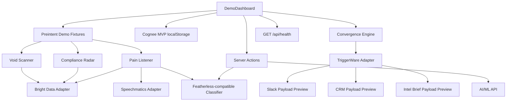

# Preintent Architecture And Endpoints

## What Was Implemented

This pass hardened Preintent from a polished demo shell into a mock-first backend-ready MVP aligned with `Project-GTM/Ideation and Architecture.md`.

Implemented changes:

- Unified Preintent domain concepts around `AccountIntelligenceProfile`, `EngineSignal`, `ConvergenceResult`, `IntelBrief`, `IntegrationStatus`, and threshold actions in `src/lib/domain.ts`.
- Added real convergence logic in `src/lib/convergence.ts`, including default 33/33/33 scoring, urgency mapping, and threshold action evaluation for 50/65/75/85/95 and single-engine 100 triggers.
- Standardized Cognee MVP persistence in `src/lib/cognee.ts` using browser `localStorage` and account-name keyed Account Intelligence Profiles.
- Added deterministic demo engine fixtures in `src/lib/preintent-demo.ts` for Void Scanner, Compliance Radar, Pain Listener, Speechmatics audio, and Intel Brief generation.
- Added mock-first sponsor integration adapters in `src/lib/integrations/`:
  - `bright-data.ts`
  - `speechmatics.ts`
  - `triggerware.ts`
  - `health.ts`
- Added `GET /api/health` for integration mode/status reporting.
- Hardened `src/app/actions.ts` so real AI/ML and Featherless-compatible calls are server-side only and safely fall back to mocks.
- Reworked `src/components/DemoDashboard.tsx` to consume the hardened architecture while keeping the dense dashboard aesthetic.
- Replaced stale GTM Haven tests with Preintent-specific tests for convergence and integration contracts.
- Rewrote Playwright e2e coverage around the actual Preintent demo flow.
- Realigned Supabase reference schema to Preintent entities for future production persistence.
- Updated README and production-readiness notes to distinguish live, mock, and deferred capabilities.

## Current Architecture



## Core Data Flow

1. `DemoDashboard` starts with the Acme FinTech target account.
2. The scan flow reveals three typed signals:
   - Void Scanner: competitor pricing tier removed.
   - Compliance Radar: PCI-DSS 4.0 deadline pressure.
   - Pain Listener: r/fintech active-evaluation post plus Speechmatics audio transcript.
3. Signals update the Cognee MVP Account Intelligence Profile in `localStorage`.
4. The Convergence Engine computes the weighted score and urgency.
5. Threshold evaluation determines which actions should fire.
6. TriggerWare preview generates CRM, Slack, and Intel Brief routing payloads.
7. Intel Brief generation runs through server actions:
   - Mock by default.
   - Real AI/ML API when `AI_ML_MODE=real` and `AI_ML_API_KEY` are configured server-side.

## Endpoint Documentation

### `GET /api/health`

Returns the current sponsor integration status based on environment modes and key presence.

Response shape:

```json
{
  "integrations": [
    {
      "id": "bright_data",
      "name": "Bright Data",
      "provider": "bright_data",
      "mode": "mock",
      "status": "healthy",
      "lastSyncAt": null,
      "detail": "Mocked scraping responses with Scraping Browser, Web Unlocker, SERP API, Web Scraper API, and MCP tags."
    }
  ]
}
```

Provider ids:

- `bright_data`
- `ai_ml_api`
- `featherless`
- `speechmatics`
- `cognee`
- `triggerware`

Status values:

- `healthy` for working mock integrations.
- `live` for configured real-mode integrations.
- `not_configured` when real mode is requested but the required key is missing.
- `disabled` when mode is explicitly disabled.

## Server Actions

### `generateRealIntelBrief(profile)`

Location: `src/app/actions.ts`

Generates an `IntelBrief` from an `AccountIntelligenceProfile`.

Behavior:

- If `AI_ML_MODE !== real` or `AI_ML_API_KEY` is missing, returns the mock Intel Brief.
- If real mode is configured, calls `${AI_ML_ENDPOINT}/chat/completions`.
- Validates the model response with `zod`.
- Falls back to a mock brief if the API request, JSON parsing, or validation fails.

Relevant environment variables:

```env
AI_ML_MODE=real
AI_ML_API_KEY=your_ai_ml_api_key_here
AI_ML_ENDPOINT=https://api.aimlapi.com/v1
AI_ML_MODEL=claude-sonnet-4
```

### `classifyPainSignal(text, context?)`

Location: `src/app/actions.ts`

Classifies community pain signals for the Pain Listener.

Behavior:

- If `FEATHERLESS_MODE`, `GROQ_MODE`, or `GEMINI_MODE` is configured as real and a key exists, calls the configured OpenAI-compatible endpoint.
- Otherwise returns a deterministic mock classification.

Relevant environment variables:

```env
FEATHERLESS_MODE=real
FEATHERLESS_API_KEY=your_featherless_key_here
FEATHERLESS_ENDPOINT=https://api.featherless.ai/v1
FEATHERLESS_MODEL=meta-llama/Llama-3.3-70B-Instruct
```

## Integration Modules

### Bright Data Adapter

Location: `src/lib/integrations/bright-data.ts`

Purpose:

- Provides a mock-first sweep for the Bright Data layer.
- Returns typed `EngineSignal` fixtures with Bright Data provenance.
- Keeps the real-mode seam ready for a future live MCP sweep.

Tools represented:

- MCP Server
- Scraping Browser
- Web Unlocker
- SERP API
- Web Scraper API

### Speechmatics Adapter

Location: `src/lib/integrations/speechmatics.ts`

Purpose:

- Provides mocked audio transcript signals with Speechmatics provenance.
- Keeps a real-mode seam for future podcast/YouTube transcription.

### TriggerWare Adapter

Location: `src/lib/integrations/triggerware.ts`

Purpose:

- Evaluates whether a profile crosses the ≥85 action threshold.
- Returns a workflow preview with:
  - threshold step
  - CRM lead payload
  - Slack alert payload
  - Intel Brief delivery request

### Integration Health Adapter

Location: `src/lib/integrations/health.ts`

Purpose:

- Reads environment modes and API-key presence.
- Produces `IntegrationStatus[]` used by `/api/health` and the Settings UI.

## Persistence Strategy

### MVP Runtime

The runtime MVP uses `localStorage` only:

```text
preintent:cognee:profiles:v1
```

Stored shape:

```ts
Record<string, AccountIntelligenceProfile>
```

Keys are account names, for example:

```text
Acme FinTech
```

### Future Supabase Schema

Supabase is not required for the zero-cost MVP. The schema is now a future-facing reference for production persistence.

Main tables:

- `organizations`
- `organization_members`
- `account_profiles`
- `engine_signals`
- `convergence_runs`
- `intel_briefs`
- `integration_connections`

## Environment Modes

All sponsor integrations are controlled by mode flags:

```env
BRIGHT_DATA_MODE=mock
AI_ML_MODE=mock
FEATHERLESS_MODE=mock
SPEECHMATICS_MODE=mock
COGNEE_MODE=mock
TRIGGERWARE_MODE=mock
SLACK_MODE=mock
HUBSPOT_MODE=mock
```

Allowed values:

- `mock`
- `real`
- `disabled`

Default behavior is mock-first and zero-cost.

## Verification

Final verification commands that passed:

```bash
npm run lint
npm run typecheck
npm run test
npm run build
npm run test:e2e
```

Verification results:

- Unit tests: 3 files, 11 tests passed.
- E2E tests: desktop and mobile passed.
- Production build includes:
  - `/`
  - `/_not-found`
  - `/api/health`

## Current Limitations

The app is backend-ready, but still intentionally mock-first for the hackathon MVP.

Deferred production work:

- Real Bright Data MCP scheduled jobs.
- Persistent hosted Cognee service.
- Real Speechmatics podcast/YouTube ingestion.
- AI/ML extraction and scoring for every engine update.
- Real TriggerWare webhook delivery.
- Slack OAuth and signed events.
- HubSpot/Salesforce OAuth and field mapping.
- Multi-user auth and workspace data loading.
